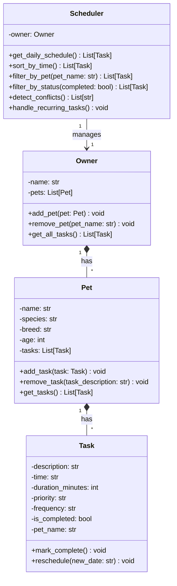

# PawPal+ — Smart Pet Care Scheduler

PawPal+ is a Streamlit app that helps a busy pet owner stay consistent with pet care. The owner enters their pets and daily care tasks; the system organises, filters, and validates the schedule automatically.

---

## Scenario

A busy pet owner needs help staying consistent with pet care. They want an assistant that can:

- Track pet care tasks (walks, feeding, meds, enrichment, grooming, etc.)
- Consider constraints (time available, priority, frequency)
- Produce a daily plan and flag potential problems

---

## Architecture

The system is built around four Python classes in `pawpal_system.py`:

| Class | Responsibility |
|---|---|
| `Task` | A single care activity with time, priority, frequency, and completion state |
| `Pet` | Stores pet details and owns a list of Tasks |
| `Owner` | Manages multiple Pets and exposes a flat view of all tasks |
| `Scheduler` | Retrieves, sorts, filters, and validates today's tasks |

### UML Diagram



---

## Features

- **Add owners, pets, and tasks** through a Streamlit browser UI
- **Sorting by time** — `sort_by_time()` uses `sorted()` with a lambda key on the `"YYYY-MM-DD HH:MM"` time string
- **Filter by pet** — see only one pet's tasks for the day
- **Filter by status** — separate pending and completed tasks
- **Conflict detection** — `detect_conflicts()` warns when two tasks for the same pet share an exact start time
- **Recurring tasks** — `handle_recurring_tasks()` automatically creates a new Task for the next day (daily) or next week (weekly) when a recurring task is marked complete
- **Progress tracking** — a progress bar shows how many of today's tasks are done

---

## Smarter Scheduling

Four algorithms power the intelligent layer:

### 1. Sorting
`Scheduler.sort_by_time()` calls Python's built-in `sorted()` with a lambda:
```python
sorted(tasks, key=lambda t: t.time)
```
Because the time string is in `"YYYY-MM-DD HH:MM"` format, lexicographic order equals chronological order — no date parsing needed.

### 2. Filtering
`filter_by_pet(pet_name)` and `filter_by_status(completed)` use list comprehensions to slice today's tasks by a single attribute. Both are O(n) over today's task count.

### 3. Conflict Detection
`detect_conflicts()` groups tasks by `pet_name`, then checks every pair within a group for a matching `time` string. A match produces a plain-English warning message instead of raising an exception, so the app stays usable even when conflicts exist.

### 4. Recurring Tasks
`handle_recurring_tasks()` iterates all tasks. For each completed `"daily"` or `"weekly"` task it uses `datetime + timedelta` to compute the next occurrence and appends a fresh Task to the pet's list. The completed task is left in place so the history is preserved.

**Tradeoff:** Conflict detection only flags tasks with an *exact* start-time match. Two tasks that merely *overlap* (e.g., a 60-minute walk starting at 07:00 and a 30-minute grooming starting at 07:30) are not flagged. This keeps the logic simple and avoids false positives for common scenarios like background feeding timers.

---

## Setup

```bash
python -m venv .venv
# Windows:
.venv\Scripts\activate
# macOS/Linux:
source .venv/bin/activate

pip install -r requirements.txt
```

---

## Running the App

```bash
streamlit run app.py
```

## CLI Demo

```bash
python main.py
```

The demo script shows the schedule sorted by time, filter-by-pet output, filter-by-status output, conflict warnings, and recurring task creation.

---

## Testing PawPal+

```bash
python -m pytest
```

### What the tests cover

| Test | What it verifies |
|---|---|
| `test_mark_complete` | `task.is_completed` flips from `False` to `True` |
| `test_add_task_to_pet` | Task count increments correctly with each `add_task()` call |
| `test_sort_by_time` | Tasks added out of order come back in chronological order |
| `test_recurring_task_creates_new_task` | Completing a daily task adds exactly one new task dated tomorrow |
| `test_detect_conflicts` | Two same-pet same-time tasks produce one warning containing the time and pet name |
| `test_no_conflict_different_times` | Tasks at different times produce zero warnings |
| `test_once_task_not_recurred` | A `"once"` frequency task is never duplicated |

**Confidence: ★★★★☆**

Core scheduling behaviours are fully covered. Edge cases not yet tested include: a pet with zero tasks, tasks on future dates filtering correctly, and overlapping-but-not-identical start times.

---

## 📸 Demo

> Add a screenshot of the running Streamlit app here.
>
> ``
